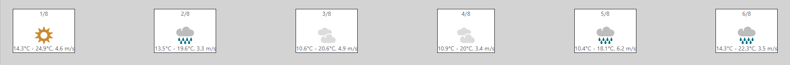
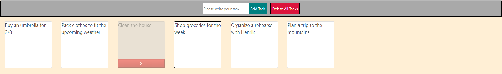
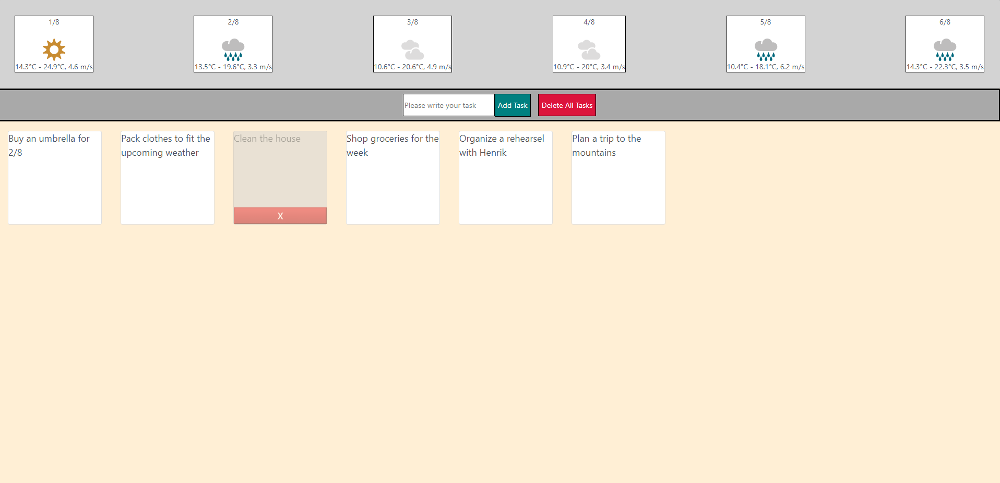

## Can't wait to try it out? Go ahead and click the link below ⬇️
Click [here](https://organizeyourday.herokuapp.com/) or copy the link organizeyourday.herokuapp.com

## Want to try out the application manually?
How cool! Simply clone this repository into your desired destination
* Inside the client folder: 
  * Install dependecies ```npm i```
* Navigate back to root ```npm i && npm run dev```

## Technologies and APIs
* React
* GraphQL (w/express, nodejs, Apollo)
* MetaWeather API (link [here](https://www.metaweather.com/api/))
 
### Motivation
For this project I am further developing a simple React todo list I have created (click [here](https://github.com/bragerosberg/ReactTodo) to see). Previously I also tested some personal ideas of mine in a *hackday* project (see it [here](https://github.com/bragerosberg/Hackday)) where I used various open APIs which all needed authentication to use. Even though the service and data they provided were absolutely amazing, I wished I could utilize something that does not require authentication so any user can test it out on their device without any unnecessary hassle. 

### Content
A todo-list is helpful and great, but does not provide to much value if it is alone. Related to this topic of tools that help ones day-to-day life would be weather forecasts. Therefor in this project I will make the combination of noting down ones task, while easily being able to observe the current weather situation. For the users convenience one can structure their day, both knowing what to expect as the weather, and the tasks for the day - all without having to navigate through multiple different applications for what could be just one. 

## Visualization of site
#### Weather tab

#### Tasks section

#### The entire site (Weather at top, task manager at bottom)



